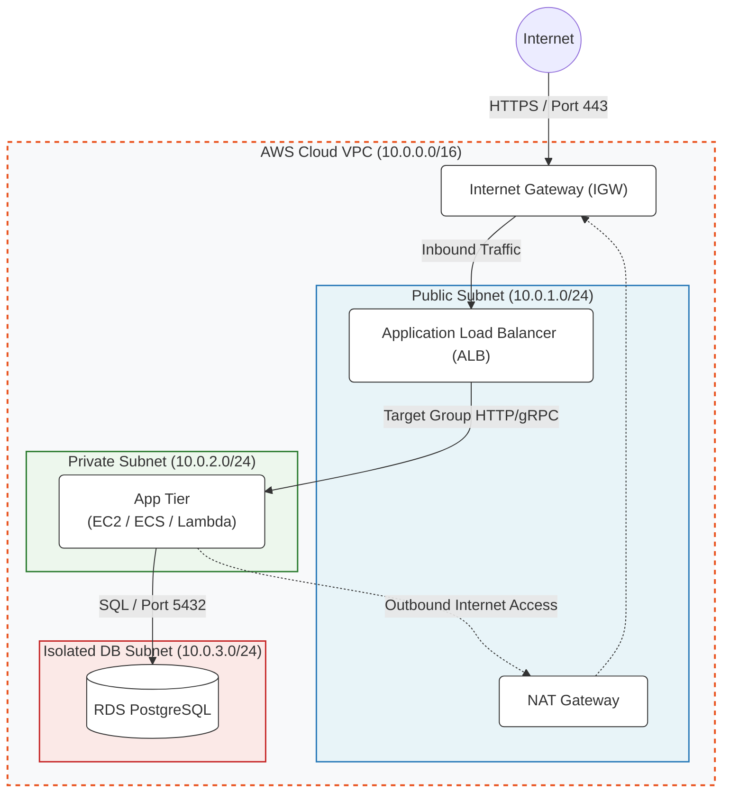

# Phase 7: Network Architecture & Cloud Computing
**Duration:** Weeks 15–17 (3 Weeks)  
**Target WGU Course:** Network Architecture and Cloud Computing (3 CUs)

---

## 1. Official WGU Competencies Covered
- [ ] Analyze network and cloud computing models to address organizational requirements.
- [ ] Explain network system interactions that underpin modern cloud computing environments.
- [ ] Design and architect secure, scalable cloud solutions for business scenarios.
- [ ] Evaluate network security architectures and defense-in-depth mechanisms.
- [ ] Formulate technical business cases for cloud adoption and cloud migration strategies.

---

## 2. Comprehensive Study Topics

### 7.1 Networking Fundamentals
- **OSI 7-Layer Model:** 
- Physical 
-  Data Link 
-  Network (IP) 
-  Transport (TCP/UDP) 
-  Session 
-  Presentation 
-  Application (HTTP/DNS).
- **TCP/IP Model:** Link, Internet, Transport, Application.
- **IP Addressing & Subnetting:** IPv4, CIDR notation (e.g., `/24` = 256 IPs), Public vs. Private IP ranges (RFC 1918).
- **Core Protocols:** TCP (connection-oriented, reliable), UDP (connectionless, low latency), DNS (port 53), HTTP/HTTPS (80/443), SSH (22).

### 7.2 Cloud Service & Deployment Models
- **Service Models:**
  - *IaaS (Infrastructure-as-a-Service):* AWS EC2, VPC, Virtual Machines.
  - *PaaS (Platform-as-a-Service):* AWS Elastic Beanstalk, Heroku.
  - *SaaS (Software-as-a-Service):* Google Workspace, Salesforce.
- **Deployment Models:** Public Cloud, Private Cloud, Hybrid Cloud, Multi-Cloud.

### 7.3 AWS Cloud Infrastructure & VPC Architecture
- **Core AWS Building Blocks:**
  - *Compute:* EC2, AWS Lambda (Serverless), ECS/EKS (Containers).
  - *Storage:* S3 (Object), EBS (Block), EFS (File).
  - *Database:* RDS (Relational), DynamoDB (NoSQL Key-Value).
  - *Networking:* VPC, Subnets, Internet Gateways (IGW), NAT Gateways, Route Tables, Security Groups, NACLs.
- **VPC Isolation Design Pattern:**
  - Public Subnets (IGW routed) for Load Balancers / Bastions.
  - Private Subnets (NAT Routed) for Application Compute / Microservices.
  - Isolated Database Subnets (No internet route) for RDS/Databases.

### 7.4 Distributed Systems & Network Security
- **Defense in Depth:** Perimeter Security 
-  Network Segmentation 
-  Host Security 
-  Identity & Access Management (IAM) 
-  Data Encryption (At-rest & In-transit).
- **CAP Theorem:** Consistency, Availability, Partition Tolerance (Choose 2 in a distributed system).
- **Edge Computing & CDNs:** AWS CloudFront, AWS Route 53 latency routing, edge caching.

---

## 3. VPC Network Architecture Blueprint



---

## 4. Phase Deliverable
**Project:** Enterprise AWS Cloud Architecture Specification  
**Requirement:** Architect a complete cloud infrastructure solution for an enterprise scenario:
1. Complete AWS VPC Network Diagram showing CIDR subnets, IGW, NAT Gateways, Security Groups, and ALB placement.
2. Cloud Infrastructure Specification detailing Compute, Storage, Database, and IAM policies.
3. Security & Defense-in-Depth Analysis evaluating Network ACLs vs. Security Groups.
4. Business Case Analysis justifying Cloud Migration ROI, Availability SLAs, and Distributed Systems trade-offs (CAP theorem).

---

## 5. Weekly Schedule & Action Plan

```
Week 15: OSI Model, TCP/IP, Subnetting, & Networking Fundamentals
├── Mon-Tue: OSI 7-layer vs TCP/IP models; Packet encapsulation.
├── Wed-Thu: IPv4 CIDR subnetting calculations (`/24`, `/16`, `/28`).
└── Fri-Sun: Core protocols (DNS, TCP 3-way handshake, TLS termination, HTTP/S).

Week 16: Cloud Models, AWS Compute/Storage, & VPC Network Design
├── Mon-Tue: Cloud service models (IaaS, PaaS, SaaS) and deployment strategies.
├── Wed-Thu: AWS core services (EC2, S3, RDS, DynamoDB, Lambda, IAM).
└── Fri-Sun: VPC architecture, Public vs Private subnets, NAT Gateways, Security Groups vs NACLs.

Week 17: Distributed Systems, Edge Computing, & Architecture Blueprint
├── Mon-Tue: CAP Theorem, eventual consistency, load balancing, CloudFront CDN.
├── Wed-Thu: Defense-in-depth security architecture in the cloud.
└── Fri-Sun: Complete Phase Deliverable (AWS Cloud Architecture Specification).
```

---

## 6. WGU Competency Verification Checklist
- [ ] Can calculate usable IP addresses for any CIDR subnet block.
- [ ] Can design a multi-tier VPC layout with public and private subnets.
- [ ] Can articulate the operational differences between Security Groups (stateful) and NACLs (stateless).
- [ ] Can explain how CAP theorem dictates database selection for global application deployments.
