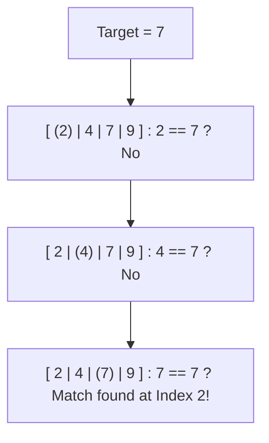
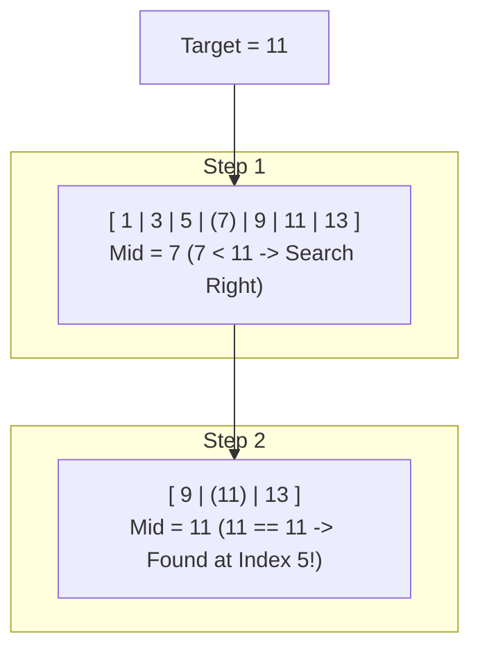

## Linear Search :
- checks each item in a collection **one by one** until the target is found.
- It has an `O(n)` Complexity, the number of operations grows directly with the number of items.
- Ideal for **Unsorted Lists/ Small collections** where checking every item is feasible.

--- 

## Binary Search:
- **"Divide and Conquer"** approach, starts in the **middle of sorted list**, 
- then repeatedly **Eliminates half** of the remaining search space - **Target is Higher - Lower**.
- Extremely **fast**; e.g. finds an item in 1,000,000 entries in only about 20 steps.
- only works on **sorted data**, e.g. **Contacts - Phone Number**

