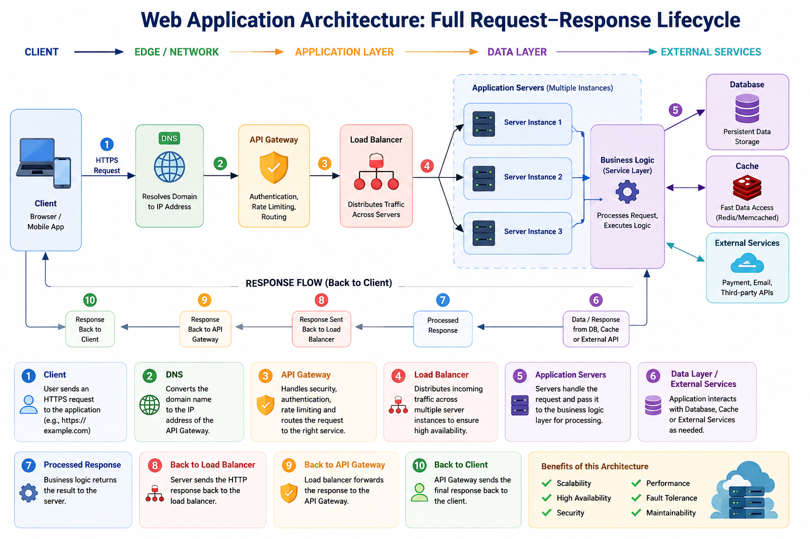
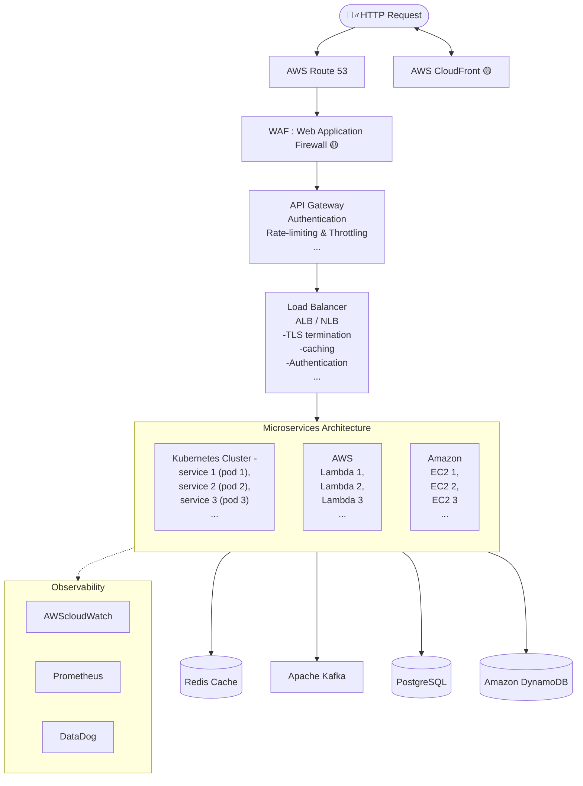

# Modern Web Application Architecture :
###  End-to-end journey of a user **request-response lifecycle** :

*   **DNS Resolution:** Translating the domain name into an IP address, route to the closest server (e.g.**Route 53**).
*   **API Gateway & Backend:** Traffic controller, validate requests and route them to specific microservices, which perform  heavy lifting.
*   **Traffic Management:** Utilizing **Nginx** for reverse proxying and **Load Balancers** to distribute traffic evenly (NLB - low-latency/high-performance; ALB - advanced path-based routing) .
*   **CDN / Content Delivery:** Caching static assets at edge locations using services like **CloudFront** - minimize latency.
*   **Security:** Using  **Web Application Firewall (WAF)** - filters out malicious traffic like SQL injection.
*   **Data & Async Tasks:** Interaction with databases (**SQL/NoSQL**) and message queues like **Kafka/SQS** for background processing.
*   **Monitoring & Optimization:** Ongoing support through authentication services, caching (e.g.**Redis**), and monitoring tools like **CloudWatch**.

---

