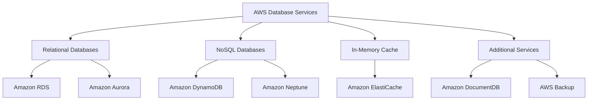

# AWS Databases :-
## A. Relational Database Services :-
- collections of data into tables with rows and columns, 
- relationships exist between different tables.
- they use structured query language, or SQL, to manage and query data.
- AWS relational databases support database engines like MySQL, PostgreSQL, and Oracle.

### 1. Amazon RDS :-
- Managed standard relational database service like - MySQL, PostgreSQL, Oracle, SQL Server.
- traits Automates backups, patching, and fixed provisioning storage.
- for Standard workloads/applications requiring traditional enterprise engines like - SQL Server or Oracle.

### 2. Amazon Aurora :-
- AWS's high-performance, cloud-native database engine compatible with MySQL and PostgreSQL.
- traits Auto-scaling storage, 6-way data replication across 3 AZs, and sub-minute failovers.
- for High-throughput, mission-critical, gaming applications, media and content management, requiring speed and reliability.
- provides comparable performance to high-end commercial databases but at one-tenth the cost, reduce database costs without sacrificing performance.

---
## B. NoSQL Database Services :-
- Non-relational, schema-flexible databases
- Instead of row and column relationships, it contains data using key-value pairs and identified by unique keys.

### 1. Amazon DynamoDB :-
- AWS's fully managed, serverless NoSQL database supporting key-value and document formats.
- traits Delivers single-digit millisecond performance, auto-scales instantly, and uses built-in multi-AZ replication.
- for Internet-scale web apps, real-time user profiles, shopping carts, and gaming state stores.

### 2. Amazon Neptune :-
- High-performance, fully managed graph database engine.
- low-latency and high-throughput performance for both read and write operations, 
- suitable for real-time applications working with connected data.
- traits Optimized for navigating and querying highly connected datasets with millisecond latency.
- for Social networks, recommendation engines, and fraud detection graphs.

---
## C. in-memory cache :-
### Overview :-
- high-speed storage layer that temporarily stores frequently accessed data in a computer's memory, or RAM. 
- Retrieving data from RAM is fast processing, 
- thousands times faster than traditional disk-based storage systems.
- When applications need specific information, they first check the cache before requesting it from the original data source.
- reduces the load on primary databases and speeds up response times.
- ideal for storing session data, API responses, database query results.

## 1. Amazon ElastiCache :-
- A fully managed, in-memory caching service compatible with Valkey, Redis OSS, and Memcached.
- traits Delivers sub-millisecond response times, offloads strain from relational databases, and automatically scales data in-memory.
- for Session management, real-time leaderboards, latency-critical web apps, and caching frequent database queries.
- high availability, When issues are detected, it maintains application availability while promoting a replica node.
- enables automatic replication across multiple AZ , protect against infrastructure failures
- supports data encryption mechanisms to safeguard sensitive information throughout its lifecycle

---
## D. Additional Database Services :-
### 1. Amazon DocumentDB :-
- Fully managed document database service compatible with MongoDB.
- existing MongoDB applications and tools will work with Amazon DocumentDB with minimal changes.
- designed to handle semistructured data,(doesn't fit into relational tables (rows and columns) but still contains organizational tags).
- traits Amazon DocumentDB is a MongoDB-compatible database, so it manages JSON-like documents with dynamic schemas.
- for applications requiring frequent schema changes.
- Content management systems, product catalogs, and user profiles.
- scalability  automatically scales storage up to 64 TB in 10 GB increments based on your application needs

### 2. AWS Backup :-
- streamlines data protection across various AWS resources and on-premises deployments by providing a single dashboard.
- eliminates the complexity of managing multiple backup strategies 
- traits Automates backup schedules, retention policies, lifecycle transitions, and cross-region/cross-account replication using tags.
- for Centralized compliance governance, disaster recovery, and simplified snapshot management across EC2, EBS, RDS, DynamoDB, S3, and EFS.

## Z. Summary :-

