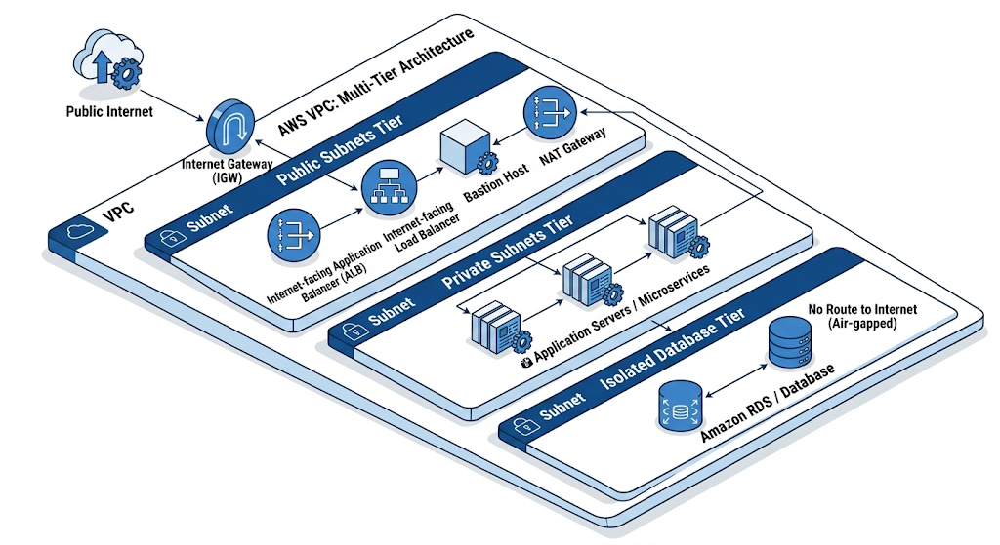

# Core AWS Building Blocks:

## Compute:
> Ec2, lambda, ECS, EKS
- [02_module-ec2.md](../07_01_AWS_cloud_computing/02_module-ec2.md)
- [03_module-compute-services.md](../07_01_AWS_cloud_computing/03_module-compute-services.md) | AWS Lambda and ECS/EKS

---
## Storage: 
> S3, EBS, EFS, FSX
- [06_module-storage.md](../07_01_AWS_cloud_computing/06_module-storage.md)

---
## Database: 
> RDS, DynamoDB
- [07_module-database.md](../07_01_AWS_cloud_computing/07_module-database.md)

---
## Networking: 
> VPC, Subnets, Internet Gateways(IGW), NAT Gateways, Route Tables, Security Groups,  NACLsb 
- [05_module-networking.md](../07_01_AWS_cloud_computing/05_module-networking.md)

---
### VPC Isolation Design Pattern:
Public Subnets (IGW routed) for Load Balancers / Bastions. 
- `todo`

Private Subnets (NAT Routed) for Application Compute / Microservices.
- `todo`

Isolated Database Subnets (No internet route) for RDS/Databases.
- `todo`

### VPC Tiering Structure:

**Public Subnets Tier:**
* Has a direct route (0.0.0.0/0) to the IGW. Hosts edge ingress components like Application Load Balancers (ALBs) and Bastion Hosts.

**Private Subnets Tier:** 
* Routes outbound internet traffic (0.0.0.0/0) to a NAT Gateway (no direct IGW route). Hosts application servers and microservices.

**Isolated Database Tier:**
* Has no route to the internet, keeping databases strictly isolated from external access.
