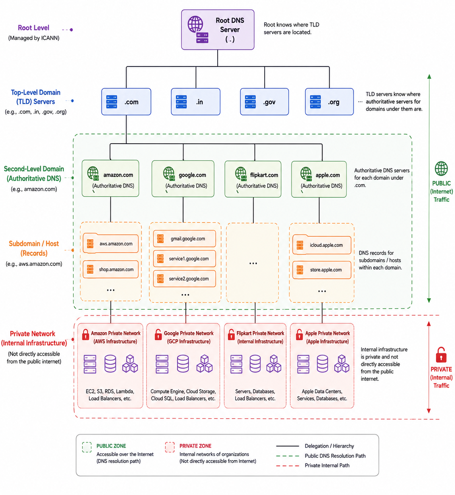
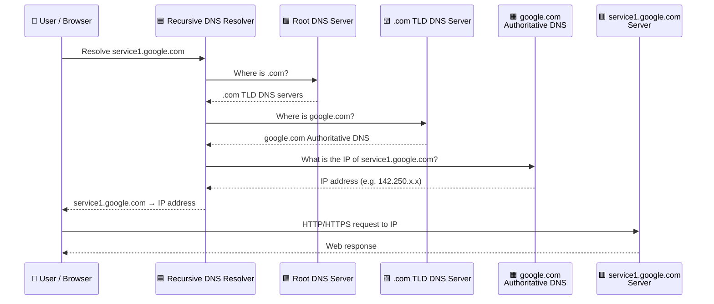

# network essential - part 1
## The OSI Model :
- The OSI (Open Systems Interconnection) model is a theoretical, seven-layer blueprint designed to standardize how network communication should occur:
- Application → Presentation → Session → Transport → Network → Data Link → Physical
- Mnemonic: A P S T N D P — All People Seem To Need Data Processing.

|  | Name              | Brief Description                                              | Examples                           |
| ----: |-------------------|----------------------------------------------------------------| ---------------------------------- |
| **7** | **Application**   | Provides network services directly to user applications.       | HTTP, HTTPS, FTP, SMTP, DNS        |
| **6** | **Presentation**  | **Data format, encryption, compression, encoding**.            | SSL/TLS, JPEG, JSON, XML           |
| **5** | **Session**       | Establishes, manages and terminates communication sessions.    | RPC, NetBIOS                       |
| **4** | **Transport**     | Breaks data into packets,**end-to-end delivery**,reliability.  | TCP, UDP                           |
| **3** | **Network**       | Handles **routing and logical addressing** between networks.   | IP, ICMP, Routers                  |
| **2** | **Data Link**     | Handles **frames, MAC addresses, and local network delivery**. | Ethernet, Wi-Fi, Switches          |
| **1** | **Physical**      | Transmits **raw data bits** over physical media.               | Cables, Fiber, Radio signals, Hubs |

---
## 🔸Layer 3 protocol.
### 1. IP (Internet Protocol): 
- Information is sent in IP packets, containing headers (source/destination address, size) and data. 
- Packet size is limited, large files  broken into multiple packets.

---
## 🔸layer 4 protocol
### 1. TCP (Transmission Control Protocol): 
- Built on top of IP,
- reliable delivery - packets do not get lost:
  - data is received in the correct order without damage. 
- It requires a handshake to establish a **connection** between the client and server, before data transfer begins.

### 2. UDP
- **fast**
- unreliable delivery - some packets get lost.
- **connectionless**

### 3. QUIC (Quick UDP Internet Connections):
- new modern, best mix of TCP & UDP.
- built on top of UDP (User Datagram Protocol),  **hence fast**,
- and TCP style **reliable delivery**
- QUIC ---> abstraction by HTTP/3

---
## 🔸layer 7 protocol
### 1. HTTP : 
#### Overview
- HyperText Transfer Protocol
- Provides a high-level abstraction on top of TCP,
- Standard protocol for transferring text and data across the web.
- Allows Structured-Request-Response that developers (java, python) use to build web applications.

```
TCP --> abstraction by HTTP/1
TCP --> abstraction by HTTP/2
QUIC --> abstraction by HTTP/3
```

#### TCP Handshake
- Essential process of establishing a reliable connection between a client and a server before any actual data transfer begins.
- During this handshake, the machines follow a structured exchange to ensure both parties are ready to communicate:

- Initiation: The client sends a packet to the server to request a connection.
- Acknowledgement: The server responds to confirm that it is available and ready to connect.
- Confirmation: Finally, the client sends a message back to the server's response, officially establishing the connection.

#### REST vs HTTP:
- REST is an architectural style for distributed systems,
- whereas HTTP is the underlying network protocol used for communication.

#### Key Issues Solved: Head-of-Line (HoL) Blocking :
- HTTP/1.1 : Suffers HOL, client sends one request at one time over a TCP connection, if one completes than second can come. 
- HTTP/2 : Solves  application-level HOL blocking, by Multiplexing, client can request data and download it simultaneously, transfers as many packets over a single TCP connections,
- HTTP/3 Solution via HTTP/2 + QUIC : Supports ORTTs (0 Round Trip Time), handles streams independently, If a packet in a stream is lost, only that stream is delayed—other streams does not stop.

### 2. Domain Name System (DNS)
- Acts as the internet's directory, translating human-readable domain names (like youtube.com) into machine-readable IP addresses.
- There are over 350 million registered domains,
- DNS is a distributed system rather than a single database to prevent overload and increase resilience against attacks.
- DNS operates in three main levels to resolve queries:
  - Root name servers: The foundation of the hierarchy; there are 13 globally.
  - TLD (Top-Level Domain) name servers: Manage domains - .org or .com.
  - Authoritative name servers: The final "source of truth" for a specific domain's IP records, holds most accurate and up-to-date information regarding the IP address.
- The Query Process:
  - When you type URL, browser checks local caches (OS, router, ISP).
  - If the IP isn't found, the query traverses the hierarchy—from root to TLD to authoritative server—to retrieve the correct destination IP address,
  - allowing your browser to connect to the site.





