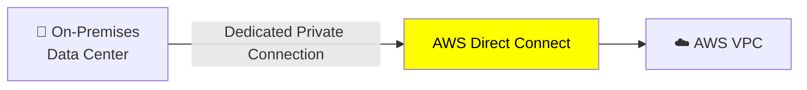

# Networking Essentials:-

## Subnets :-
- To organize resources, share resources publicly, or isolate privately.

### 1. Private subnets :-
- **Isolated resources** that shouldn't be directly exposed to the public internet.
- can Initiate **outbound connections (updates/patches)** and blocking inbound traffic.
- e.g. database that contains customers’ personal information and order histories.
  
### 2. Public subnets :-
- provide direct internet access to resources placed inside them.
- e.g. online store’s website,
- allowing access, that are connected with an IGW.

## firewall :-
- The movement of data packets traveling across a network
- A packet is a unit of data sent over the internet or a network.
- It enters into VPC through an IGW.
- Before a packet enter or exit from a subnet, it will run into several checks for permissions,
- If permissions defined, **NACL indicates allowed or denied**.

### 1. NACLs (Network Access Control Lists) :-
- **Virtual firewall** controlling traffic, operate at the subnet level,
- **Evaluate traffic** before it **enters/leaves subnet**,
- **Stateless: return traffic only allowed by rules**
- **Remembers nothing** and check packets that cross the subnet border - inbound/outbout
- Modify/add rules : When configuring VPC, use account’s default or create custom NACLs.
- **Newly created NACLs deny everything** : great way of **blocking specific IP address** at the subnet level

### 2. Security groups :-
- Operate at the **Instance level**,
- **Virtual firewall for EC2 instances**, by default inbound/outbound not allowed
- **Stateful: return traffic is automatically allowed, regardless of rules**
- **Control Inbound - Outbound traffic**
- custom rules are added, which traffic should be allowed.
- It is the VPC component that checks packet permissions for an Amazon EC2 instance.

##  IGW, NAT-GW and Route Table:-
- First, create the IGW. Other-wise users can't get to resources.
- Then, create Route-Tables to route traffic,

### 1. Internet Gateway (IGW) :-
- IGW on their own do not allow Internet access
- **Horizontally scaled and Highly Available VPC component** that allows communication between VPC and Internet.
- Serves two purposes: Targets in  VPC route tables for internet-routable traffic, and performs NAT for instances (public IPv4 addresses).
- Must be created separately from a VPC
- One VPC can only be attached to one IGW and vice versa.

### 2. Network Address Translation Gateway service (NAT-GW):-
- **AWS-managed NAT**, higher bandwidth, high availability
- created in a **specific Availability Zone**,
- Requires an **IGW (Private Subnet => NATGW => IGW)**,
- translates/changes the IP address
- by default inbout/outbound traffic allowed.
- instances in private subnet can connect to services outside VPC, but external services cannot start a connection
- placed in public subnet with an Elastic IP (EIP)-
- Must create multiple NAT-GW in multiple AZs for fault-tolerance

### 3. Route Table :-
- contains set of rules called routes, used to know where network traffic from subnet/gateway is directed.
- Every VPC has a main route table, create custom route tables for specific subnets.

---
## Boundaries around AWS resources :-
### 1. Amazon Virtual Private Cloud (AWS :: VPC) :-
- VPC is used to establish **boundaries around AWS resources**.
- **Solid box**, and it represents your isolated, logically segmented network within AWS.
- Helps to control network resources and security.

### 2. Virtual private network(Customer :: VPN) :-
- A VPN encrypts your internet traffic, protect it from anyone who might try to enter/monitor it.
- connects your **Remote workforce to AWS** or on-premises with a VPN.
- ideal for a newly expanded worldwide remote workforce.

### 3. Virtual private gateway (VPG :: customer :: VPN):-
- Allows protected internet traffic to enter into the VPN.

### 4. AWS Site-to-Site VPN :-
- connect **branch offices/data centers** (fixed locations)
- not ideal for remote workers.
- is an **encrypted network connection** to your Amazon VPCs.
- **vpc-1 <--> site-2-site <--> vpc-2**
- 
### 5. AWS Direct Connect :-
- **private, dedicated AWS connection** to your data center or office.
- takes time to set up, physical wiring.
- lots of data flow between corporate data centers and AWS.
- huge data transfers take a long time over the public Internet, opt for Direct Connect instead.
- not designed for remote worker
- AWS **vpc-1 <--> AWS Direct Connect <--> Client vpn-1**
- data transfers between your on-premises network and AWS.

### 6. AWS PrivateLink and VPC endpoint:-
- Private connectivity between VPCs, AWS services, and on-premises applications 
- without exposing traffic to the public internet
- connects your VPC privately to services and resources as though they were in your VPC.

---
## Three Edge networking services :-
- important because organizations need lower latency,
- fast access to their data and content.
- tasks like caching data locally or closer to users, deliver faster.

### 6.1. Amazon Route 53 :-
DNS
- DNS is like the phone book of the internet.
- DNS is the process of translating a domain name to an IP address.
- Customer enters web address and able to access the website, because of DNS resolution.

R53
- Is DNS that provides a reliable and cost-effective way to route end users to internet applications.
- connects user requests to infrastructure running in AWS, e.g.Amazon EC2 instances and load balancers. 
- also routes to infrastructure outside of AWS.
- ability to manage all the DNS records for domain names in single service.
- register new domain names directly in Route 53. 

### 6.2. Amazon CloudFront / CDN :-
- content delivery network (CDN) service, delivers your content with faster loading times,cost savings.
- global network of delivery trucks that quickly brings web content to users around the world. 
- stores copies of your content at locations closer to your users. 
- means websites, videos, images, and applications load much faster, no matter where your customers are located.
- e.g. websites  streaming-workout videos, ecommerce-shopping, mobile-map data  

### 6.3. AWS Global Accelerator :-
- uses intelligent traffic routing and fast failover if something goes wrong in your 1 application locations.
- networking service that helps your applications run faster  across the globe. 
- user requests through regular congested internet route, It creates express lane on the internet highway
- getting users to your application faster and more reliably.
- e.g. Gaming company - lag free gameplay; Banking app - fastaccess to accounts.

